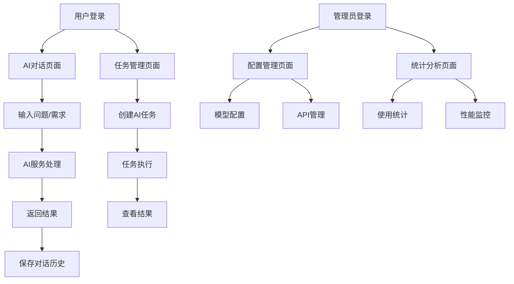

# AegisX 智能体插件产品需求文档

## 1. 产品概述

AegisX 智能体插件是一个基于 PF4J 框架开发的企业级AI服务集成插件，旨在为AegisX平台提供强大的人工智能处理能力。该插件能够接收用户的自然语言输入，调用多种AI服务进行智能处理，并返回高质量的处理结果。

插件支持文本生成、智能问答、代码生成、文档分析等多种AI任务，通过标准化的RESTful API接口与主应用系统无缝集成，为企业用户提供便捷、高效的AI辅助服务。

## 2. 核心功能

### 2.1 用户角色

| 角色 | 注册方式 | 核心权限 |
|------|----------|----------|
| 普通用户 | 系统注册用户 | 可使用基础AI功能，每日调用次数限制 |
| 高级用户 | 管理员升级 | 可使用全部AI功能，更高的调用次数限制 |
| 管理员 | 系统管理员 | 可管理插件配置、查看使用统计、用户权限管理 |

### 2.2 功能模块

我们的智能体插件包含以下主要页面：

1. **AI对话页面**：智能对话界面、历史记录查看、对话管理功能
2. **任务管理页面**：任务创建、进度跟踪、结果查看
3. **配置管理页面**：AI模型配置、API密钥管理、参数调优
4. **统计分析页面**：使用统计、性能分析、成本监控

### 2.3 页面详情

| 页面名称 | 模块名称 | 功能描述 |
|----------|----------|----------|
| AI对话页面 | 对话界面 | 提供实时AI对话功能，支持多轮对话，保存对话历史 |
| AI对话页面 | 历史记录 | 查看和管理历史对话记录，支持搜索和分类 |
| 任务管理页面 | 任务创建 | 创建各类AI处理任务（文本生成、代码生成、文档分析等） |
| 任务管理页面 | 进度跟踪 | 实时显示任务执行状态和进度信息 |
| 任务管理页面 | 结果查看 | 展示任务处理结果，支持下载和分享 |
| 配置管理页面 | 模型配置 | 配置不同的AI模型参数和调用策略 |
| 配置管理页面 | API管理 | 管理各种AI服务的API密钥和配置信息 |
| 统计分析页面 | 使用统计 | 显示插件使用情况、调用次数、用户活跃度等统计信息 |
| 统计分析页面 | 性能监控 | 监控AI服务响应时间、成功率等性能指标 |

## 3. 核心流程

**普通用户使用流程：**
用户登录系统后，进入AI对话页面，输入自然语言问题或需求，系统调用配置的AI服务进行处理，返回智能化的回答或处理结果。用户可以查看历史对话记录，创建特定的AI处理任务。

**管理员管理流程：**
管理员可以访问配置管理页面，设置AI模型参数、管理API密钥、调整用户权限。通过统计分析页面监控插件使用情况和性能表现，进行系统优化。

## 4. 用户界面设计

### 4.1 设计风格

- **主色调**：深蓝色 (#1890FF) 和浅灰色 (#F5F5F5)
- **辅助色**：绿色 (#52C41A) 表示成功，红色 (#FF4D4F) 表示错误
- **按钮样式**：